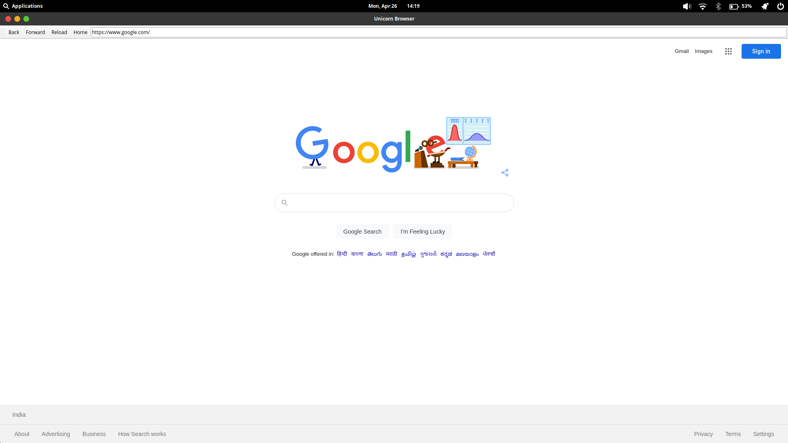
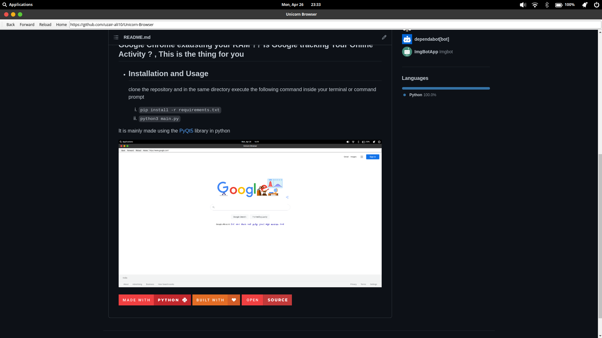

# Unicorn Browser

**Google Chrome exausting your RAM ?? Is Google tracking Your Online Activity ? , This is the thing for you**
----------------------------
- ## Installation and Usage
    clone the repository and in the same directory execute the following command inside your terminal or command prompt

   1.  `pip install -r requirements.txt`
   2.  `python3 main.py`

It is mainly made using the [PyQt5](https://pypi.org/project/PyQt5/) library in python

